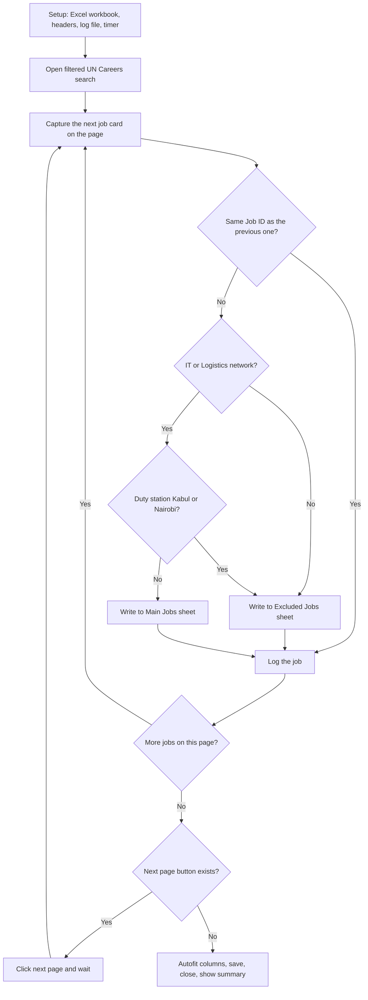

# UN Careers Job Extraction Bot

An Automation Anywhere (A360) bot that goes through the job listings on the UN Careers portal, collects the details of each job, filters them by job network and duty station, and saves everything into an Excel file with a text log of the run.

> **Note:** This README was written with Claude's help. The bot itself, including all of its logic, was built by hand by me.
>
> I don't condone relying on AI completely. It degrades your thinking ability and makes you dependent on it. But we are in an AI era, and not integrating it into your daily workflow can be just as detrimental. My approach is to do the thinking and the building myself, and use AI as a tool for things like documentation, where it saves time without replacing what I need to learn.

This is an independent learning project built during my AI & Intelligent Process Automation internship at Orion Valley Academy. It is not affiliated with or endorsed by the United Nations. The bot only reads publicly listed job postings.

## Contents

- [What the bot does](#what-the-bot-does)
- [Flow diagram](#flow-diagram)
- [Data collected](#data-collected)
- [Filtering rules](#filtering-rules)
- [How it works step by step](#how-it-works-step-by-step)
- [Technical notes and limitations](#technical-notes-and-limitations)
- [Tools used](#tools-used)
- [Running the bot](#running-the-bot)
- [Author](#author)

## What the bot does

Searching the portal by hand means opening every page, reading every job card, and copying details into a spreadsheet. The bot does that loop automatically:

1. Opens the UN Careers job search with the filters already applied in the URL.
2. Goes through every page of results until there is no next page.
3. Captures the details of each job card.
4. Sorts each job into one of two Excel sheets.
5. Writes a line to a log file for every job it processes.
6. Saves the workbook and shows a summary when it is done.

## Flow diagram



## Data collected

Each job is saved with these columns:

| Column | Where it comes from |
| --- | --- |
| Job Name | HTML title of the job link |
| Job ID | Extracted from the job link URL |
| Job Link | HTML href of the job link |
| Job Network | Text on the job card |
| Duty Station | Text on the job card |
| Date Posted | Text on the job card |
| Deadline | Text on the job card |

## Filtering rules

Every job goes through these checks in order:

| Check | Result |
| --- | --- |
| Same Job ID as the previous job | Skipped, so duplicates are not written twice |
| Network is not Information and Telecommunication Technology or Logistics, Transportation and Supply Chain | Excluded Jobs sheet |
| Network matches, but duty station is Kabul or Nairobi | Excluded Jobs sheet |
| Network matches and duty station is anything else | Main Jobs sheet |

## How it works step by step

1. Setup. Records the start time, creates the log file, creates an Excel workbook with two sheets (Main Jobs and Excluded Jobs), and writes the headers on both.
2. Launch. Opens the filtered UN Careers search in the browser, maximizes the window, and waits for the page to load.
3. Outer loop. Keeps going while a next page exists.
4. Inner loop. Goes through the 10 job cards on the current page. For each one it captures the title, link, network, duty station, date posted, and deadline using the Recorder.
5. Cleaning. Removes label text from the captured values (for example "Job ID :" or "Deadline :") so only the actual value ends up in the cell.
6. Routing and logging. Applies the filtering rules, writes the row to the correct sheet, and adds a line to the log file.
7. Pagination. If the next page button exists, it clicks it and waits. If not, the loop stops.
8. Finish. Autofits the columns on both sheets, saves and closes Excel, closes the browser tab, calculates how long the run took, shows a summary message box, and logs the final stats.

## Technical notes and limitations

- The Job ID is not captured directly. It is extracted from the job link by taking the text between `jobSearchDescription/` and `?`. If the UN Careers site changes its URL structure, this will break and need updating.
- The job name is taken from the HTML title property of the job link, so it also depends on the page structure staying the same.
- The inner loop assumes 10 jobs per page. A page with a different number of results would need that value changed.
- The last page is detected through a Try/Catch block. When the bot tries to reach a next page that does not exist, the error is caught on purpose and used to end the loop cleanly.
- The Excel and log file paths are set for my own machine. Change them in the bot before running it somewhere else.

## Tools used

| Tool | Used for |
| --- | --- |
| Automation Anywhere A360 | Building the bot (Recorder, Excel advanced, String, Loop, If, Error handler, Logging) |
| Microsoft Excel | Output workbook with the Main Jobs and Excluded Jobs sheets |
| Google Chrome | Browsing the UN Careers portal |

## Repository contents

```
job-extraction-bot/
  README.md
  UN Careers Job Extraction Bot/    exported bot package from Control Room
```

## Running the bot

1. In Control Room, import the exported package.
2. Open the bot and update the Excel and log file paths to ones on your machine.
3. Run the bot and let it go through all the pages.
4. When it finishes, open the Excel file to see the Main Jobs and Excluded Jobs sheets, and check the log file for the run details.

## Author

Marwan Karam, Computer Engineering student

LinkedIn: https://www.linkedin.com/in/mkaram209/
